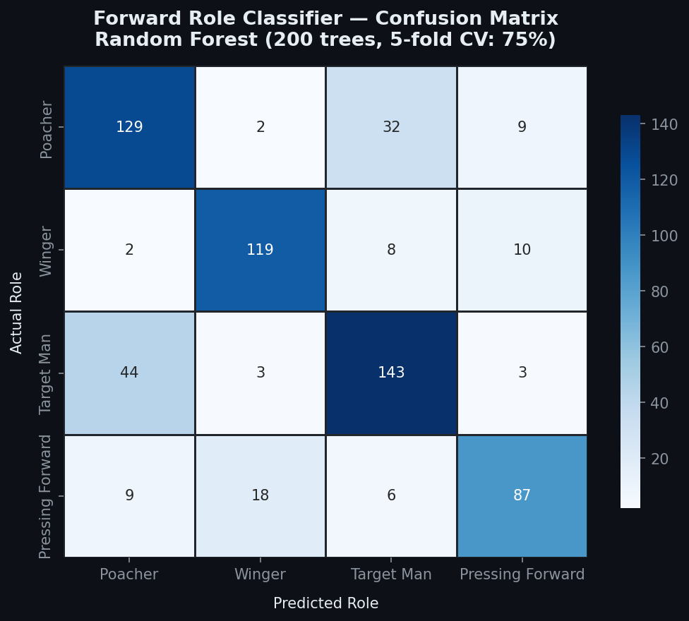
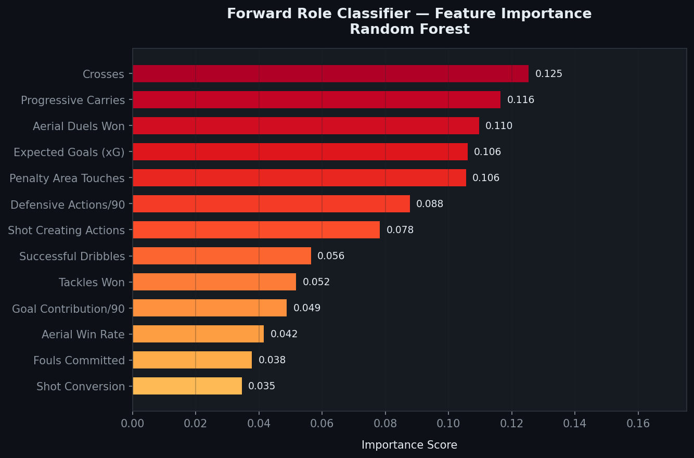

# Football Analytics — Player Role Classification & Similarity Engine

A data science project built on Top 5 European League football data (2017 to 2025).
Covers data cleaning, unsupervised and supervised machine learning, an interactive
Streamlit dashboard, and a Power BI report for business stakeholder presentation.

**Leagues:** Premier League · La Liga · Bundesliga · Serie A · Ligue 1
**Seasons:** 2017-18 to 2024-25
**Records:** 18,616 player-seasons · 5,766 unique players

---


---

## Table of Contents

- [Project Structure](#project-structure)
- [Problem Statement](#problem-statement)
- [Data Pipeline](#data-pipeline)
- [Machine Learning](#machine-learning)
- [Streamlit Dashboard](#streamlit-dashboard)
- [Power BI Report](#power-bi-report)
- [How to Run](#how-to-run)
- [Key Findings](#key-findings)
- [Skills Demonstrated](#skills-demonstrated)
- [Limitations and Future Work](#limitations-and-future-work)

---

## Project Structure

```
football_project2/
│
├── assets/                                          ← screenshots for README
│   ├── app_home.png
│   ├── forward_roles_page.png
│   ├── similarity_page.png
│   ├── player_search_page.png
│   └── powerbi_report.png
│
├── data/
│   ├── Top5_League_Players_2017to2024_dataset.csv   ← raw data (not uploaded to GitHub)
│   ├── cleaned.csv                                  ← generated by data_prep.py
│   ├── forward_roles.csv                            ← generated by forward_roles.py
│   ├── powerbi_players.csv                          ← generated by generate_powerbi_data.py
│   └── powerbi_forwards.csv                         ← generated by generate_powerbi_data.py
│
├── models/
│   ├── forward_roles.pkl                            ← KMeans + Random Forest model
│   └── player_similarity.pkl                        ← KMeans + cosine similarity matrices
│
├── plots/
│   ├── role_confusion_matrix.png                    ← model evaluation chart
│   └── role_feature_importance.png                  ← model evaluation chart
│
├── .streamlit/
│   └── config.toml                                  ← hides Streamlit toolbar
│
├── data_prep.py                                     ← Step 1: clean and deduplicate
├── forward_roles.py                                 ← Step 2: role clustering and classifier
├── player_similarity.py                             ← Step 3: similarity engine
├── generate_powerbi_data.py                         ← Step 4: generate Power BI CSVs
├── app.py                                           ← Step 5: Streamlit dashboard
├── requirements.txt
└── README.md
```

---

## Problem Statement

Standard football datasets classify players only by broad position — GK, DF, MF, FW.
This tells you nothing about how a player actually plays. A Poacher and a Pressing Forward
are both classified as FW but have completely different profiles.

This project solves two problems:

**1. Forward Role Classification**
Automatically identify the tactical role of any forward — Poacher, Winger, Target Man,
or Pressing Forward — purely from their statistics. No manual labelling required.

**2. Player Similarity**
Given any player, find the 5 most statistically similar players in the dataset.
Filter by age to find younger cheaper alternatives — directly useful for transfer scouting.

---

## Data Pipeline

### Raw Data Issues Found

- 511 duplicate rows — same player, same season, same team appearing multiple times
- European comma decimal format — values stored as `6,1` instead of `6.1`
- 178 columns — majority irrelevant, required careful feature selection
- Players with fewer than 5 matches — insufficient data for reliable analysis

### Cleaning Steps

**Deduplication:**
```python
df = df.drop_duplicates(subset=['player', 'season', 'team'])
```
Removed 511 duplicate rows. This was the critical fix — previous analysis
without this step inflated career totals significantly.

**Decimal conversion:**
```python
df = pd.read_csv(path, sep=';', decimal=',')
```
Handled at load time using pandas decimal parameter.

**Minimum playing time filter:**
Players with fewer than 5 matches removed — 4,313 rows dropped.

### Feature Engineering

Six new features created from existing columns:

| Feature | Formula | Purpose |
|---------|---------|---------|
| `goal_contrib_p90` | (Goals + Assists) / 90s | Attacking output per 90 |
| `xG_overperformance` | Goals − xG | Clinical finishing above expectation |
| `progressive_impact_p90` | (PrgC + PrgP) / 90s | Ball progression per 90 |
| `defensive_actions_p90` | (Tackles + Int + Blocks) / 90s | Defensive work rate per 90 |
| `aerial_dominance` | Aerial Won / Total Aerials | Aerial duel win rate |
| `shot_conversion` | Goals / Shots | Goals scored per shot attempted |

---

## Machine Learning

### Model 1 — Forward Role Classifier

**The Problem:**
No role labels exist in the dataset. You cannot train a classifier without labels.

**The Solution — Two step pipeline:**

**Step 1: KMeans Clustering (Unsupervised)**

Aggregate each forward to one row (career average) and cluster into 4 groups
using 13 carefully selected features. KMeans finds natural groupings in the data.

Cluster centres are then interpreted using football domain knowledge:

| Defining Stat | Role Assigned |
|--------------|--------------|
| Highest `shot_conversion` | Poacher |
| Highest `Take-Ons_Succ` | Winger |
| Highest `aerial_dominance` | Target Man |
| Highest `defensive_actions_p90` | Pressing Forward |

**Step 2: Random Forest Classifier (Supervised)**

Once every player has a role label from clustering, a Random Forest is trained
on per-season rows to learn the patterns behind each role.

```
Training data : 80% of forward season rows
Test data     : 20% of forward season rows
Trees         : 200
Max depth     : 10
```

**Results:**

| Metric | Score |
|--------|-------|
| Cross-Validation Accuracy | 75% |
| Test Accuracy | 77% |

**Confusion Matrix:**



**Feature Importance:**



**Why 77% accuracy is reasonable:**
Labels came from clustering, not verified ground truth. Some players
genuinely sit between roles — an attacking midfielder playing as a forward
will have mixed characteristics. Winger achieves the highest precision
because dribbling and crossing stats are very distinctive.

---

### Model 2 — Player Similarity Engine

**Approach: KMeans + Cosine Similarity**

**Why not just cosine similarity globally?**
Computing cosine similarity across all 5,766 players globally works but
becomes slow at scale. More importantly, a goalkeeper would be compared
against a striker — which is meaningless.

**Why not just KMeans alone?**
KMeans assigns hard cluster boundaries. Two similar players near a
boundary could end up in different clusters and never be compared.

**Combined approach:**
KMeans groups players by overall style first, then cosine similarity
ranks precisely within each cluster.

**Key design decision — unit normalisation before KMeans:**

KMeans uses Euclidean distance internally. Cosine similarity measures
angle between vectors. These are inconsistent by default.

When vectors are unit normalised (length = 1), Euclidean distance
and cosine distance become mathematically equivalent:

```python
from sklearn.preprocessing import normalize
X_unit = normalize(X_scaled, norm='l2')
kmeans = KMeans(n_clusters=15)
kmeans.fit(X_unit)
```

Now KMeans clusters by playing style direction, not by volume of stats.

**Why 15 clusters:**
```
GK  : ~2 styles
DF  : ~4 styles
MF  : ~4 styles
FW  : ~4 styles
Total = 14 to 16  →  15
```
Aligns with real football tactical structure.

**21 features used:**

| Category | Features |
|----------|---------|
| Attacking output | goal_contrib_p90, shot_conversion, Expected_xG, Expected_xAG, Standard_Dist |
| Chance creation | SCA_SCA, GCA_GCA, KP_, PPA_, CrsPA_, 1/3_ |
| Progression | progressive_impact_p90, Touches_Att Pen |
| Dribbling | Take-Ons_Att, Take-Ons_Succ% |
| Defensive | defensive_actions_p90, aerial_dominance, Performance_Int, Tackles_TklW, Performance_Fls |
| Ball retention | Carries_Dis |

**Example results:**

| Search Player | Similar Players Found |
|--------------|----------------------|
| Kevin De Bruyne | Szoboszlai, Payet, Gibbs-White |
| Erling Haaland | Vardy, Aubameyang, Lewandowski |
| Virgil van Dijk | Ruben Dias, Thiago Silva |


---

## Streamlit Dashboard

4 page interactive application built with Streamlit.

**Page 1 — Home**
Dataset overview, all-time leaders, goals per season by league chart.


**Page 2 — Forward Role Classifier**
Browse players by role, model evaluation with confusion matrix and
feature importance, live role prediction widget.


**Page 3 — Player Similarity**
Search any player, find top 5 similar players, filter by age,
grouped bar chart comparison of key stats.


**Page 4 — Player Search**
Individual career profile, season by season stats table,
goals and assists bar chart, xG vs actual goals line chart
with colour fill showing over and underperformance.


---

## Power BI Report

A 3 page business-facing report built in Power BI Desktop
using two focused CSV files generated from the cleaned data.

**Data sources used:**
- `powerbi_players.csv` — 18,616 rows, 42 columns, one row per player per season
- `powerbi_forwards.csv` — 1,749 rows, 20 columns, one row per forward with role label

**Pages:**

| Page | Key Visuals |
|------|------------|
| League Overview | Goals per season line chart, league comparison bar chart, position stats table, top 5 scorers and assisters |
| Forward Roles | Role distribution donut, avg stats per role bar charts, top players table with conditional formatting, age vs goals scatter |
| Player Profile | Career KPI cards, goals and assists column chart, xG vs actual goals line chart, season by season table |


---

## How to Run

**Step 1 — Install dependencies**
```bash
pip install -r requirements.txt
```

**Step 2 — Run scripts in order**
```bash
python data_prep.py
python forward_roles.py
python player_similarity.py
python generate_powerbi_data.py
```

**Step 3 — Launch Streamlit dashboard**
```bash
streamlit run app.py
```

**Step 4 — Open Power BI report**
Open Power BI Desktop → load `powerbi_players.csv` and `powerbi_forwards.csv`
from the data folder → build visuals as described above.

---

## Key Findings

- **511 duplicate rows** were found in the raw dataset — career totals were
  significantly inflated before deduplication was applied

- **Lionel Messi** leads in career goals, assists, and xG across the dataset period

- **Wingers** are the most precisely classified forward role because dribbling
  and crossing stats are highly distinctive compared to other roles

- **Erling Haaland** clusters with classic penalty box strikers — Vardy,
  Aubameyang, Lewandowski — confirming his poacher profile statistically

- **xG overperformance** is highest among players with high shot conversion
  and low shot volume — true clinical finishers rather than high volume shooters

- **Bundesliga defenders** rank highest in progressive impact — reflecting
  the league's high press and build-from-back tactical style

---

## Skills Demonstrated

| Skill | Where Applied |
|-------|--------------|
| Data cleaning and deduplication | data_prep.py |
| Feature engineering | data_prep.py |
| Unsupervised ML — KMeans clustering | forward_roles.py, player_similarity.py |
| Supervised ML — Random Forest classification | forward_roles.py |
| Model evaluation — confusion matrix, cross validation, feature importance | forward_roles.py |
| Similarity search — cosine similarity | player_similarity.py |
| Unit normalisation for cosine-equivalent KMeans | player_similarity.py |
| Streamlit dashboard development | app.py |
| Power BI report development | Power BI Desktop |
| Domain knowledge application — football tactics | Throughout |

---

## Limitations and Future Work

**Known limitations:**

- Forward role labels came from clustering, not verified ground truth —
  accuracy is bounded by the quality of the unsupervised labels

- Players are identified by name only — no player ID in the dataset.
  Name spelling differences across seasons could split one player into two entries

- Cosine similarity within clusters misses cross-cluster matches —
  a player near a cluster boundary may have a closer match in an adjacent cluster

- Dataset covers only Top 5 leagues — players from other leagues are not
  included in the similarity engine even if statistically comparable

**Potential future additions:**

- Next season goal prediction using lag features — genuinely predictive regression
- Role classification extended to defenders and midfielders
- Global cosine similarity as fallback when cluster has fewer than 10 players
- Elbow method to determine optimal number of clusters mathematically
- Separate similarity models per position for more contextually meaningful results

---

## Dataset Source

FBref via soccerdata Python library.
Covers Premier League, La Liga, Bundesliga, Serie A, Ligue 1 — 2017-18 to 2024-25.

---

## Requirements

```
pandas>=2.0.0
numpy>=1.24.0
matplotlib>=3.7.0
scikit-learn>=1.3.0
joblib>=1.3.0
streamlit>=1.28.0
```
